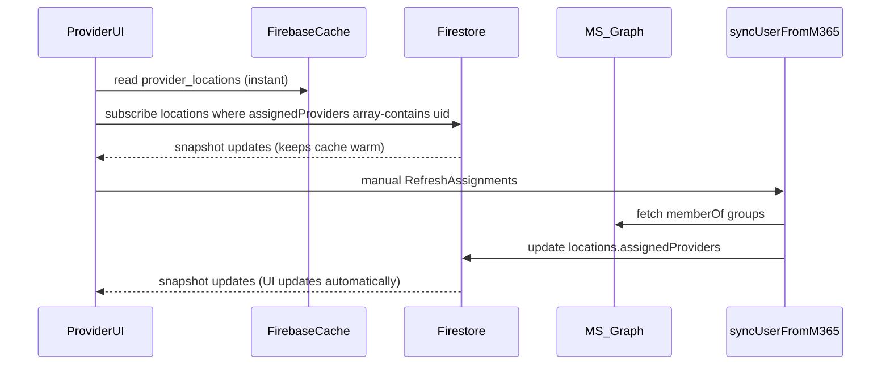

# Data & State Management (Provider) Plan

### What the acceptance criteria is really asking for (and what it is NOT)

- **Not asking you to replace Graph**: The criteria in `docs/provider-performance-audit.md` is about **client data loading** (cache-first + SWR + realtime updates), not about changing the assignment authority.
- **More performant path (compatible with Graph)**: Keep Graph as the source of truth for membership, but treat Firestore (`locations.assignedProviders`) as the **queryable index** that the app reads from, and make those reads **cache-first**.
  - Your current Cloud Function already does this indexing by writing to `locations.assignedProviders`.
  - The missing part is that Provider UI still does one-off `getDocs` reads via `locationService`.

### Key design decisions (based on your answers)

- **M365 → Firestore sync**: **Manual only** (user/admin initiates refresh).
- **Assignment index in Firestore**: **Only `locations.assignedProviders`** (stop using `assignments` collection in the cache path).

### Implementation steps

#### 1) Build a provider-locations hook that implements cache-first + SWR + listener

- Add a dedicated hook (recommended new file):
  - [`src/lib/hooks/useProviderLocations.ts`](src/lib/hooks/useProviderLocations.ts)
- Responsibilities:
  - **Cache-first**: call `getCachedLocationsByProvider(uid)` to render immediately.
  - **SWR**: after rendering cached data, start a listener (or a force refresh) to revalidate.
  - **Realtime cache updates**: use `subscribeToCachedCollection` from [`src/lib/firebase/cachedFirestore.ts`](src/lib/firebase/cachedFirestore.ts) with:
    - filters: `assignedProviders array-contains uid`, `active == true`
    - order: `name asc`
  - Expose:
    - `locations`, `loading`, `error`
    - `refreshAssignments()` (calls M365 sync + revalidates locations)
    - `refreshLocations()` (force-refresh Firestore/cache without touching M365)

#### 2) Fix `getCachedLocationsByProvider` to match the canonical model

- Update [`src/lib/firebase/cachedFirestore.ts`](src/lib/firebase/cachedFirestore.ts):
  - **Remove** the initial query to `COLLECTIONS.ASSIGNMENTS` in `getCachedLocationsByProvider` (it’s currently a guaranteed extra network roundtrip in your model).
  - Make the cached query match the provider UI needs:
    - `where("assignedProviders", "array-contains", providerId)`
    - `where("active", "==", true)`
    - `orderBy("name")`
  - Ensure the cache key stays stable per provider (e.g. `provider_locations_${providerId}_active`), so the SchoolList always hits the same entry.

#### 3) Wire the Provider UI to the new hook (remove direct `getDocs` calls)

- Update [`src/components/provider/SchoolList.tsx`](src/components/provider/SchoolList.tsx):
  - Replace `getAssignedLocations(user.uid)` with the new `useProviderLocations()` hook.
  - Preserve existing distance calculations (still OK client-side).
  - Loading behavior:
    - If cached data exists: **render it immediately**, show a subtle “Updating…” state if desired.
    - If no cached data: keep existing skeleton loading.

- Update [`src/app/dashboard/page.tsx`](src/app/dashboard/page.tsx):
  - Stop calling `getAssignedLocations` in an effect for `assignedSchoolsCount` / `locationsMap`.
  - Use the same provider locations hook so the dashboard count is also cache-first.

#### 4) Add manual “Refresh assignments” UX (your chosen sync strategy)

- Add a button in a high-visibility provider area (recommended: dashboard header or inside `SchoolList` card):
  - Label: “Refresh assignments”
  - Behavior:
    - Calls `syncUserFromM365()` from [`src/lib/firebase/auth.ts`](src/lib/firebase/auth.ts)
    - Then triggers `refreshLocations()` (force refresh cache) OR relies on the active Firestore listener to update.
  - Add minimal UI states:
    - disabled while running
    - success/failure toast (or inline message)

#### 5) Update tests to reflect cache-first + subscription behavior

- Update [`src/components/provider/SchoolList.test.tsx`](src/components/provider/SchoolList.test.tsx):
  - Stop mocking `locationService.getAssignedLocations`.
  - Mock the new hook (preferred) or mock `getCachedLocationsByProvider` + `subscribeToCachedCollection`.
  - Add at least one test that verifies:
    - cached locations render without waiting for the network path
    - subscription update replaces the list

#### 6) Close the acceptance-criteria loop in docs

- Update the evidence/notes in [`docs/provider-performance-audit.md`](docs/provider-performance-audit.md) (or add a short “done” note elsewhere) to reflect:
  - cache-first provider list via `FirebaseCache`
  - SWR achieved via app-level revalidation + Firestore snapshot listeners (not Serwist fetch caching)

### Files likely touched

- [`src/lib/firebase/cachedFirestore.ts`](src/lib/firebase/cachedFirestore.ts)
- [`src/lib/hooks/useProviderLocations.ts`](src/lib/hooks/useProviderLocations.ts) (new)
- [`src/components/provider/SchoolList.tsx`](src/components/provider/SchoolList.tsx)
- [`src/app/dashboard/page.tsx`](src/app/dashboard/page.tsx)
- [`src/components/provider/SchoolList.test.tsx`](src/components/provider/SchoolList.test.tsx)
- [`docs/provider-performance-audit.md`](docs/provider-performance-audit.md)

### Implementation todos

- **provider-locations-hook**: Add `useProviderLocations` implementing cache-first + SWR + listener.
- **cache-model-align**: Remove `assignments` prequery and align `getCachedLocationsByProvider` to `locations.assignedProviders`.
- **ui-wireup**: Switch `SchoolList` + provider dashboard count/map to the hook.
- **manual-refresh**: Add “Refresh assignments” button that calls `syncUserFromM365` and revalidates.
- **tests-update**: Update `SchoolList` unit tests for the new data path.
- **docs-evidence**: Update audit doc evidence/notes for Epic 2 Story 2.1.