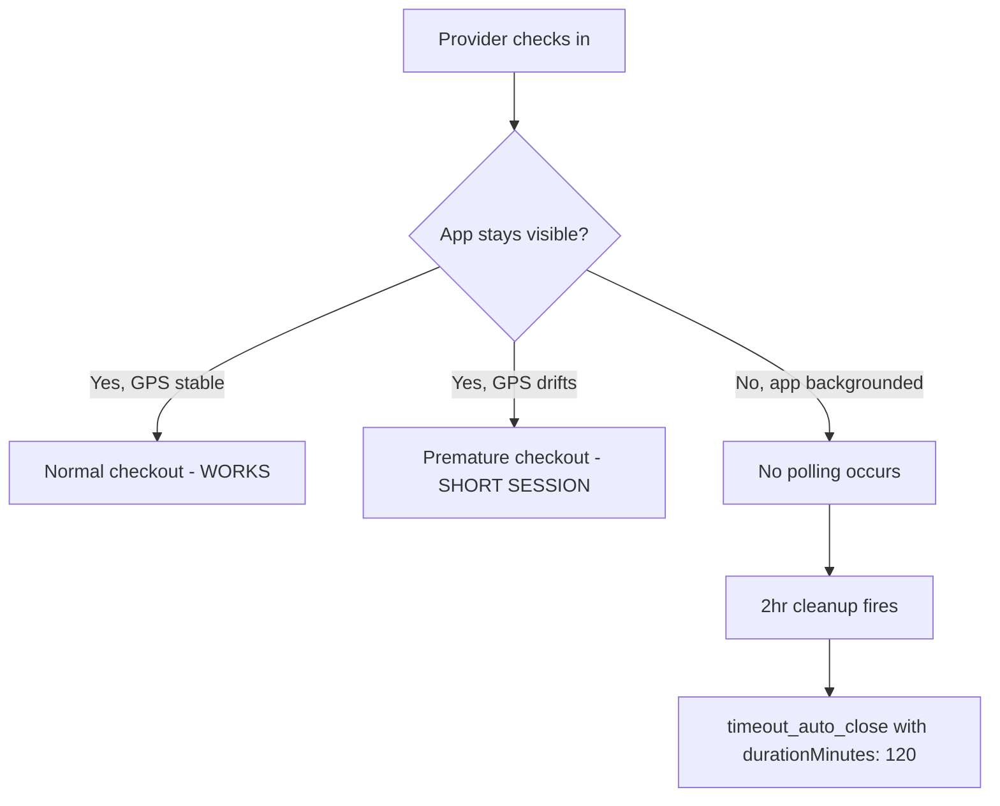
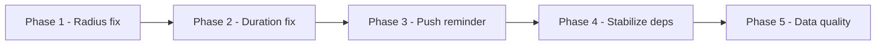

# Fix Session Lifecycle and Geofence Reliability

## Problem Summary

Two symptoms affecting all 31 users:

1. Many `timeout_auto_close` sessions -- because auto-checkout only works when the app is visible
2. Short/inaccurate session durations -- from GPS jitter checkouts and hardcoded cleanup durations



---

## Phase 1: Critical Server/Client Mismatch (Deploy immediately)

### 1A. Fix Cloud Function radius fallback

[functions/src/index.ts](functions/src/index.ts) line 549 -- the server-side geofence validation still defaults to 100m when a location document lacks `radiusMeters`. This causes valid check-ins to be **rejected** for users within 100-300m of the school center.

Change:

```typescript
const radiusMeters = locationData.radiusMeters || 100;
```

to:

```typescript
const radiusMeters = locationData.radiusMeters || 300;
```

### 1B. Fix `getActiveRadius()` fallback

[src/lib/hooks/useAutoGeofenceCheck.ts](src/lib/hooks/useAutoGeofenceCheck.ts) line 166 -- the adaptive polling interval calculator falls back to 100m, causing wrong near/far boundary calculations.

Change `return 100;` to `return 300;`.

### 1C. Fix seed script default

[scripts/seed-firestore.ts](scripts/seed-firestore.ts) line 58 -- the seed script still creates schools with `radius: 100`.

Change to `radius: 300`.

---

## Phase 2: Fix `timeout_auto_close` Duration Accuracy (High priority)

### 2A. Calculate actual per-session duration in cleanup function

[functions/src/index.ts](functions/src/index.ts) lines 864-906 -- currently every timed-out session gets `durationMinutes: 120` regardless of actual elapsed time. This corrupts reporting data.

Inside the `sessionMap.forEach` loop, calculate duration from the session's actual start time:

```typescript
const sessionStart =
  data.startTime?.toMillis?.() || data.checkInTime?.toMillis?.() || 0;
const actualDurationMs = cutoff.toMillis() - sessionStart;
const actualDurationMinutes =
  sessionStart > 0 ? Math.floor(actualDurationMs / 60000) : durationMinutes; // fallback to max if no start time
```

Then use `actualDurationMinutes` instead of the hardcoded `durationMinutes` in the batch update.

---

## Phase 3: Server-Side Session Reminder via Push (High priority)

This addresses the **root cause** of `timeout_auto_close`: the app can't poll when backgrounded. Instead of relying on client-side polling, send a push notification from the server reminding the provider to open the app so auto-checkout can run.

> **Note:** Providers cannot manually check out -- checkout is handled automatically by the geofence polling loop when the app is in the foreground. The push notification's goal is simply to get the provider to open the app so the geofence poll can fire.

### 3A. Add a "warning" pass to `cleanupStaleSessions`

[functions/src/index.ts](functions/src/index.ts) -- before the cleanup queries, add a separate query for sessions approaching timeout (e.g., 90 minutes old but not yet 120 minutes). Send a push notification to the provider reminding them their session is still active.

This leverages the existing push notification infrastructure (VAPID keys, admin notification code already in the function) but targets the **session owner** (provider) instead of admins.

This requires:

- Querying sessions where start time is between 90min and 120min ago
- Looking up the user's FCM token from their user document or a `pushSubscriptions` collection
- Sending a push notification: "Still at the school? Your session has been active for 90+ minutes. Open the app to update your status."

### 3B. Add a "still here?" prompt when app regains visibility

[src/lib/hooks/useAutoGeofenceCheck.ts](src/lib/hooks/useAutoGeofenceCheck.ts) -- the visibility change handler at line 1067 already runs a poll when the document becomes visible. Add logic: if an active session has been running for 30+ minutes and the app just became visible, show a prominent toast asking "Still at [school]?" with a Stay Checked In button (and let the normal geofence poll handle checkout if they've left), **before** running the geofence poll.

---

## Phase 4: Stabilize Polling Effect Dependencies (Medium priority)

### 4A. Fix unstable `checkOut` callback reference

[src/lib/hooks/useSession.ts](src/lib/hooks/useSession.ts) line 199 -- `checkOut` has `[currentSession, sessions, user?.uid]` as dependencies, but none of those are actually used in the callback body (it takes `sessionId` as a parameter). Every time `sessions` updates from the real-time listener, `checkOut` gets a new reference, tearing down and recreating the entire polling interval.

Change the dependency array to `[user?.uid]` (the only closure variable actually read).

Similarly for `checkIn` at line 131: it reads `currentSession` for the guard check, but that can use a ref instead. At minimum, change to `[user]`.

### 4B. Consolidate dual real-time listeners

[src/lib/hooks/useSession.ts](src/lib/hooks/useSession.ts) lines 298-344 -- the two competing `onSnapshot` listeners (new schema + legacy) can race and flicker `currentSession` between null and a session object, cascading into the geofence effect.

Merge into a single listener that queries both schemas in one pass, or make the legacy listener only set state if the primary listener hasn't already:

```typescript
const unsubNew = onSnapshot(activeQ, (snap) => {
  if (snap.empty) {
    // Don't null out immediately -- let a short delay check legacy
    setCurrentSession((prev) => (prev?.active === true ? prev : null));
    return;
  }
  // ... set session from new schema
});
```

Better approach: remove the legacy listener entirely if all sessions in Firestore now use the `status` field. Run a one-time migration script to set `status: "active"` on any document that has `active: true` but no `status` field.

---

## Phase 5: Fix `distanceFromCenterAtCheckIn` Data Quality (Low priority)

### 5A. Pass actual distance instead of GPS accuracy

Three files send `location.accuracy` where they should send the distance from `validateGeofence()`:

- [src/lib/hooks/useSession.ts](src/lib/hooks/useSession.ts) line 73
- [src/lib/offline/queueManager.ts](src/lib/offline/queueManager.ts) line 126
- [src/lib/services/serviceManager.ts](src/lib/services/serviceManager.ts) line 140

The auto-geofence check-in path in `useAutoGeofenceCheck.ts` already has the distance available from `validateGeofence()`. Thread it through to the `checkIn()` call. For the `useSession.checkIn()` path, either:

- Accept distance as an additional parameter, or
- Calculate it client-side before calling the Cloud Function (the server recalculates anyway, so this is for data quality on the client-side session object)

---

## Deployment Order



- **Phase 1**: Deploy immediately as a hotfix (3 one-line changes)
- **Phase 2**: Deploy with Phase 1 (small change in cleanup function)
- **Phase 3**: Next sprint -- requires push notification plumbing to individual users
- **Phase 4**: Next sprint -- requires careful testing of session state transitions
- **Phase 5**: Low priority -- server already recalculates, this is a correctness cleanup
