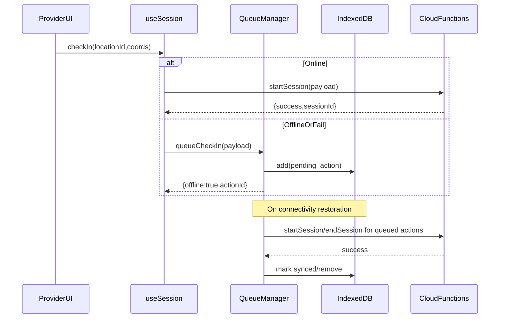

# Offline Session Logging Plan

## Key answers to your performance questions

### **1) Why does “SW intercepts the request” matter?**

- **What it’s trying to guarantee**: A Service Worker `fetch` interception can ensure “any attempted check-in/out network call” is captured and persisted even if a developer forgets to add explicit offline handling in UI code.
- **Why it’s not the best fit here**: Your check-in path is a Firebase Callable (`httpsCallable('startSession')`) and check-out is a Firestore update today. Intercepting those requests at the SW layer would require returning a *synthetic response* in the exact format the Firebase SDK expects—high risk and easy to break.
- **Performance impact**: true `fetch` interception tends to add overhead (request cloning, body reads, IDB writes) on *every* matching request. An app-level queue only writes to IDB when you are offline (or when a request fails), which is materially cheaper for battery and data.

**Conclusion**: meet the acceptance criterion’s intent using app-level queueing (you selected this), and keep the SW for caching + background triggers only.

### **2) Are “custom sync systems” and “parallel queue systems” the same thing?**

They overlap, but they’re not identical:

- **System A (schools-in-offline DB)**: `src/lib/offline/offlineDB.ts` + `src/lib/offline/serviceManager.ts` + SW schema duplication in `src/app/sw.ts`.
- **System B (schools-in-cache DB)**: `src/lib/offline/actionQueue.ts` + `src/lib/offline/queueManager.ts` + `src/lib/offline/syncManager.ts`.

The UI offline status is already wired to **System B** via `src/lib/hooks/useEnhancedOfflineQueue.ts` (which uses `queueManager`).

**Performance risk today**: two queues + two sync orchestrators means duplicated IDB writes, multiple timers/loops, and the `syncManager.syncSingleAction()` placeholder currently calling `processQueue()` (whole-queue) per action—this can multiply work and waste battery.

### **3) What fallback do we need?**

We need provider check-in/out to **enqueue** when offline (or when online calls fail) and show pending status:

- **Provider check-in**: if offline, store a “start session” action locally and immediately reflect “pending sync” in UI.
- **Provider check-out**: same, but for “end session.”
- **On connectivity return**: process queued actions with backoff + batching.

## Recommended implementation path (meets acceptance criteria)

### **A) Pick one queue system (use the one the UI already uses)**

- **Keep**: `src/lib/offline/actionQueue.ts`, `src/lib/offline/queueManager.ts`, `src/lib/offline/syncManager.ts`, `src/lib/hooks/useEnhancedOfflineQueue.ts`.
- **Stop using for sessions** (or remove later): `src/lib/offline/offlineDB.ts` + `src/lib/offline/serviceManager.ts` session queueing/sync.
- **SW (`src/app/sw.ts`)**: keep caching + background messaging, but don’t treat it as the source of truth for session actions.

### **B) Make queued sync go through Cloud Functions (server invariants)**

- You already have `functions/src/index.ts` → `exports.startSession` which validates role, assignments, and geofence.
- Add a new callable **`endSession`** (or `completeSession`) that:
  - verifies auth + session belongs to user
  - verifies session is active/paused
  - sets `endTime`, `checkOutTime`, `status: 'completed'`, duration fields
  - optionally stores checkout location + distance if you need it

### **C) Wire provider flow to the queue manager**

- Update `src/lib/hooks/useSession.ts` so `checkIn/checkOut` use the unified queue path:
  - online check-in: call `httpsCallable('startSession')`
  - online check-out: call `httpsCallable('endSession')`
  - offline (or online failure): call `queueManager.checkIn/checkOut` (which updates the queue used by offline UI)

This closes the “critical wiring gap” called out in the audit.

### **D) Fix the performance footgun in `syncManager`**

- Replace `syncManager.syncSingleAction()` implementation so it does not call `processQueue()` (full-queue) per action.
- Options:
  - export a real “process one action” function from `actionQueue.ts`, or
  - make `syncManager` do batch processing itself without re-walking the full queue.

### **E) Ensure the UI actually surfaces pending session sync**

- Since `src/components/offline/*` already uses `useEnhancedOfflineQueue`, once provider actions enqueue into `queueManager`, “Pending Sync” should become real.
- Add/verify a provider page placement of an offline indicator if it’s not already visible in provider UI.

## Data flow (target)

## Files most likely to change

- `src/lib/hooks/useSession.ts`
- `src/lib/offline/queueManager.ts`
- `src/lib/offline/actionQueue.ts`
- `src/lib/offline/syncManager.ts`
- `functions/src/index.ts` (add `endSession` callable)
- Potentially reduce/retire: `src/lib/offline/serviceManager.ts`, `src/lib/offline/offlineDB.ts` for session actions

## Implementation todos