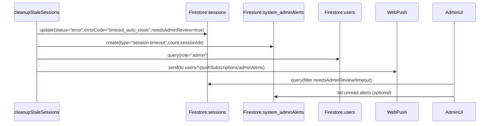

# Plan: Clear stuck-session status + admin notification

## Goals

- Replace the confusing **`status: "error"`** presentation for timeout auto-closures with a clear label like **“Auto-closed (timeout)”**.
- Ensure admins can **discover, triage, and mark reviewed** any auto-closed sessions.
- Add **push notifications** to admins (opt-in) when `cleanupStaleSessions` auto-closes sessions.

## What we’ll leverage (already in repo)

- Scheduled auto-closure job:
  - [`functions/src/index.ts`](functions/src/index.ts) `exports.cleanupStaleSessions` sets `status: "error"` and `notes: "Session automatically closed due to timeout."` every 15 minutes.
- Admin UI already flags errors:
  - [`src/components/admin/SessionManagement.tsx`](src/components/admin/SessionManagement.tsx) treats `session.status === "error"` as needing attention.
- Push infra already exists end-to-end:
  - Client saves subscription at `users/{uid}/pushSubscriptions/geofence` via [`src/lib/pwa/pushReminders.ts`](src/lib/pwa/pushReminders.ts)
  - Functions use `web-push` in [`functions/src/index.ts`](functions/src/index.ts)

## Design

### 1) Distinguish “timeout auto-closed” from generic errors

Because you chose **keep `status="error"` but relabel**, we’ll add a structured discriminator while keeping the stored status the same.

- **Add to session documents** (written only by the cleanup job):
  - `errorCode: "timeout_auto_close"`
  - `needsAdminReview: true`
  - `adminReviewStatus: "unreviewed"` (or `adminReviewedAt`, see below)

This lets the UI:

- Display **“Auto-closed (timeout)”** for timeout auto-closures.
- Still display **“Error”** for other error cases.

### 2) Admin review queue in the admin UI

Update [`src/components/admin/SessionManagement.tsx`](src/components/admin/SessionManagement.tsx) to:

- **Split** “Sessions Needing Attention” into at least:
  - **Auto-closed (timeout)** (status=error + errorCode timeout)
  - **Other errors** (status=error + not timeout)
  - **Active too long / Paused** (existing)
- Show a clear explanation row-level:
  - e.g. “Auto-closed by system after 2h timeout (cleanup job).”
- Add an action to **mark reviewed**:
  - updates `needsAdminReview=false` and either sets `adminReviewedAt=Timestamp.now()` and `adminReviewedBy=<adminUid>` or sets `adminReviewStatus="reviewed"`.

### 3) Push notifications to admins (opt-in)

We’ll reuse the existing web-push plumbing but avoid coupling admin alerts to “geofence reminders”.

- **Client**: add a small “Admin alerts” opt-in UI for admins (location TBD—likely Admin dashboard settings panel) that:
  - requests Notification permission
  - subscribes using `NEXT_PUBLIC_VAPID_PUBLIC_KEY`
  - saves the subscription in `users/{uid}/pushSubscriptions/adminAlerts` (new doc id)
- **Functions**: enhance `cleanupStaleSessions` so that when it closes one or more sessions:
  - queries `users` where `role == "admin"`
  - for each admin, loads `pushSubscriptions/adminAlerts`
  - sends a single push per admin per cleanup run with:
    - title: “Session auto-closed (timeout)”
    - body: “{N} session(s) were auto-closed and need review.”
    - data: `{ type: "session-timeout", count: N }`

### 4) Persistent audit trail / “unread” tracking (recommended)

To ensure admins don’t miss pushes and can see historical events, write an alert record:

- Create `system/adminAlerts/{alertId}` (or `system/adminAlerts` subcollection) with:
  - `type: "session-timeout"`
  - `createdAt`
  - `sessionIds` (capped)
  - `count`
  - `status: "unread" | "read"`

Admin UI can show an **“Unread auto-closures”** count and a list that links to sessions.

## Data flow

## Files likely to change

- [`functions/src/index.ts`](functions/src/index.ts):
  - extend `cleanupStaleSessions` session updates
  - add “send admin push on auto-closure” helper reusing `initializeWebPush`/`sendPushNotification`
  - (optional) write `system/adminAlerts` docs
- [`src/lib/firebase/types.ts`](src/lib/firebase/types.ts): extend `Session` type to include the new fields (optional/nullable)
- [`src/lib/utils/session.ts`](src/lib/utils/session.ts):
  - add `getSessionStatusConfigFromSession(session)` to map timeout errors to label “Auto-closed (timeout)”
- [`src/components/admin/SessionManagement.tsx`](src/components/admin/SessionManagement.tsx):
  - display new label + new section + mark-reviewed action
- Admin settings UI (exact file depends on where admin dashboard settings live):
  - use helper(s) from [`src/lib/pwa/pushReminders.ts`](src/lib/pwa/pushReminders.ts) but save under `pushSubscriptions/adminAlerts`

## Validation / acceptance checks

- Creating a stale session and waiting for cleanup results in:
  - session status still `error` (unchanged)
  - UI shows **Auto-closed (timeout)** (not generic “Error”)
  - session appears in **Auto-closed (timeout)** admin review list
  - admins who opted in receive a push
  - clicking “Mark reviewed” removes it from the review queue

## Rollout note

- Backward compatibility is preserved:
  - existing sessions with `status="error"` but without `errorCode` will still show as “Error”.