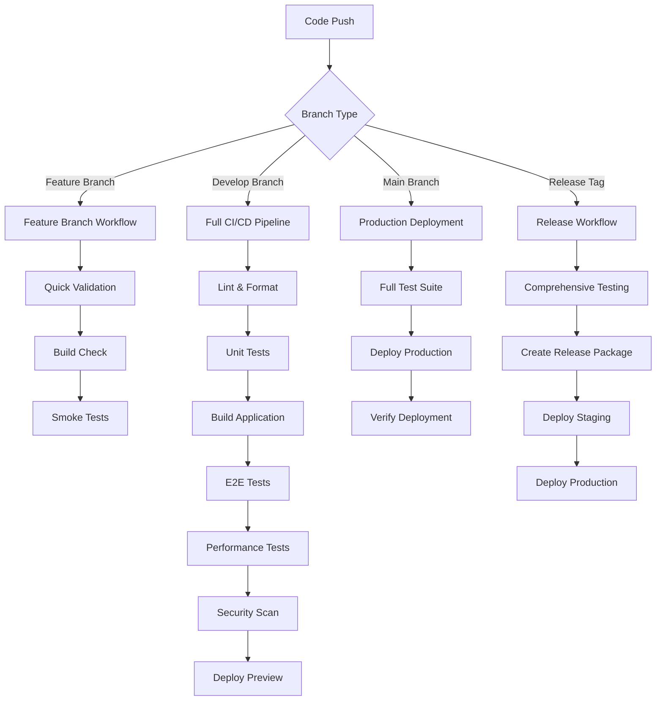

# CI/CD Pipeline Guide

This document describes the comprehensive CI/CD pipeline for the Schools-In application, including automated testing, deployment, and monitoring.

## Overview

The CI/CD pipeline ensures code quality, security, performance, and accessibility through automated testing and deployment workflows.

### Pipeline Architecture



## Workflows

### 1. Feature Branch Workflow (`.github/workflows/feature-branch.yml`)

**Triggers**: Push to feature branches, PRs to develop

**Jobs**:
- **Quick Validation**: Linting, type checking, unit tests
- **Build Check**: Application build and bundle size check
- **Smoke Test**: Basic E2E tests
- **Security Check**: npm audit
- **PR Status**: Summary for code review

**Duration**: ~5-10 minutes

### 2. Main CI/CD Pipeline (`.github/workflows/ci-cd.yml`)

**Triggers**: Push to main/develop, PRs to main/develop

**Jobs**:
- **Lint & Format**: ESLint, TypeScript checking
- **Unit Tests**: Jest with coverage reporting
- **Build**: Next.js application build
- **E2E Tests**: Multi-browser Cypress tests
- **Performance & Accessibility**: Lighthouse CI, Web Vitals
- **Security Scan**: Vulnerability scanning
- **Firebase Rules Test**: Firestore and Storage rules validation
- **Deploy Preview**: Firebase preview deployment (PRs)
- **Deploy Production**: Firebase production deployment (main branch)
- **Verify Deployment**: Smoke tests on live environment
- **Test Results**: Comprehensive reporting
- **Notify**: Slack notifications

**Duration**: ~15-25 minutes

### 3. Performance & Accessibility (`.github/workflows/performance-accessibility.yml`)

**Triggers**: Push to main/develop

**Jobs**:
- **Lighthouse CI**: Performance, accessibility, SEO auditing
- **Cypress Performance**: Custom performance tests
- **Accessibility Audit**: WCAG 2.1 AA compliance testing
- **Performance Budget**: Bundle size and metric validation

### 4. Release Workflow (`.github/workflows/release.yml`)

**Triggers**: Release creation, manual dispatch

**Jobs**:
- **Pre-Release Tests**: Complete test suite
- **Security Scan**: Comprehensive security audit
- **Performance Baseline**: Lighthouse baseline generation
- **Create Release Package**: Production build packaging
- **Deploy Staging**: Staging environment deployment
- **Staging Verification**: Staging environment testing
- **Deploy Production**: Production deployment
- **Production Verification**: Live environment validation
- **Release Notification**: Success/failure notifications

**Duration**: ~30-45 minutes

## Environment Configuration

### Required Secrets

#### Firebase
- `FIREBASE_SERVICE_ACCOUNT_SCHOOLS_IN_CHECK`: Service account JSON
- `FIREBASE_TOKEN`: Firebase CLI token
- `NEXT_PUBLIC_FIREBASE_API_KEY`: Firebase API key
- `NEXT_PUBLIC_FIREBASE_AUTH_DOMAIN`: Auth domain
- `NEXT_PUBLIC_FIREBASE_PROJECT_ID`: Project ID
- `NEXT_PUBLIC_FIREBASE_STORAGE_BUCKET`: Storage bucket
- `NEXT_PUBLIC_FIREBASE_MESSAGING_SENDER_ID`: Messaging sender ID
- `NEXT_PUBLIC_FIREBASE_APP_ID`: App ID

#### External Services
- `LHCI_GITHUB_APP_TOKEN`: Lighthouse CI token
- `SLACK_WEBHOOK`: Slack notification webhook
- `SNYK_TOKEN`: Snyk security scanning token

### Environment Protection Rules

#### Production Environment
- **Required reviewers**: 2 team members
- **Wait timer**: 5 minutes
- **Restrict to main branch**: Yes
- **Required status checks**: All CI jobs must pass

#### Staging Environment
- **Required reviewers**: 1 team member
- **Restrict to develop/main**: Yes

## Testing Strategy

### Test Types and Coverage

| Test Type | Framework | Coverage | Duration | Frequency |
|-----------|-----------|----------|----------|-----------|
| **Unit Tests** | Jest + RTL | Components, utilities, services | ~2-5 min | Every commit |
| **Integration Tests** | Jest | API routes, Firebase integration | ~3-7 min | Every commit |
| **E2E Tests** | Cypress | User workflows, critical paths | ~10-15 min | PR + main |
| **Performance Tests** | Lighthouse + Cypress | Core Web Vitals, load times | ~5-10 min | PR + main |
| **Accessibility Tests** | axe-core + Cypress | WCAG 2.1 AA compliance | ~3-5 min | PR + main |
| **Security Tests** | npm audit + Snyk | Vulnerability scanning | ~2-3 min | Every commit |
| **Firebase Rules** | Rules unit testing | Security rules validation | ~1-2 min | Rule changes |

### Performance Standards

| Metric | Target | Budget | Action on Failure |
|--------|--------|--------|-------------------|
| **Lighthouse Performance** | ≥ 80 | ≥ 75 | Warning below 75, fail below 65 |
| **Bundle Size** | < 1MB | < 2MB | Warning above 1MB, fail above 2MB |
| **LCP** | < 2.5s | < 4.0s | Fail above 4s |
| **FID** | < 100ms | < 300ms | Fail above 300ms |
| **CLS** | < 0.1 | < 0.25 | Fail above 0.25 |

### Accessibility Standards

- **WCAG 2.1 AA Compliance**: 100% required
- **Lighthouse Accessibility**: ≥ 95
- **Color Contrast**: ≥ 4.5:1
- **Keyboard Navigation**: 100% coverage

## Deployment Strategy

### Branch Strategy

```
main (production)
├── develop (staging)
├── feature/task-123
├── bugfix/issue-456
└── hotfix/critical-fix
```

### Deployment Environments

| Environment | Branch | URL | Purpose |
|-------------|---------|-----|---------|
| **Production** | main | https://schools-in-check.web.app | Live application |
| **Staging** | develop | Preview URLs | Pre-production testing |
| **Preview** | PR branches | Firebase preview channels | Code review |
| **Local** | Any | localhost:3000 | Development |

### Deployment Process

1. **Feature Development**: Create feature branch from develop
2. **Pull Request**: Create PR to develop branch
3. **Preview Deployment**: Automatic preview deployment
4. **Code Review**: Team review with automated checks
5. **Merge to Develop**: Deploy to staging environment
6. **Release Preparation**: Merge develop to main
7. **Production Deployment**: Automatic deployment to production
8. **Post-Deployment Verification**: Automated smoke tests

## Monitoring and Alerting

### Real-Time Monitoring

- **Uptime Monitoring**: Firebase hosting status
- **Performance Monitoring**: Web Vitals tracking
- **Error Tracking**: Firebase Crashlytics
- **Security Monitoring**: Firebase security rules logs

### Alerts and Notifications

#### Slack Notifications
- ✅ Successful deployments
- ❌ Failed builds or deployments
- ⚠️ Security vulnerabilities found
- 📊 Performance degradation alerts
- 🚀 Release notifications

#### Alert Conditions
- Build failures
- Test failures
- Security vulnerabilities (high/critical)
- Performance degradation (>20% regression)
- Accessibility violations
- Deployment failures

## Troubleshooting

### Common Issues

#### Build Failures
```bash
# Check TypeScript errors
npx tsc --noEmit

# Check linting issues
npm run lint:fix

# Check test failures
npm test -- --verbose
```

#### Deployment Failures
```bash
# Check Firebase authentication
firebase login --reauth

# Verify project configuration
firebase use --add

# Test deployment locally
firebase serve
```

#### Performance Issues
```bash
# Run performance tests locally
npm run lighthouse:local

# Check bundle analysis
npm run build -- --analyze

# Monitor Web Vitals
npm run dev # Open Performance Monitor
```

#### Security Issues
```bash
# Run security audit
npm audit

# Fix vulnerabilities
npm audit fix

# Check for sensitive data
git log --grep="secret\|password\|key" --all
```

### Rollback Procedures

#### Production Rollback
1. Identify last known good deployment
2. Revert to previous Firebase hosting version:
   ```bash
   firebase hosting:releases:list
   firebase hosting:releases:rollback
   ```
3. Notify team of rollback
4. Create hotfix branch if needed

#### Database Schema Rollback
1. Use Firebase console to restore Firestore data
2. Revert security rules to previous version
3. Test data integrity

## Best Practices

### Code Quality
- Write meaningful commit messages
- Keep PRs small and focused
- Include comprehensive tests
- Document complex logic
- Follow TypeScript best practices

### Security
- Never commit secrets or credentials
- Use environment variables for sensitive data
- Regularly update dependencies
- Follow Firebase security best practices
- Implement proper input validation

### Performance
- Monitor bundle size regularly
- Optimize images and assets
- Implement proper caching strategies
- Use code splitting effectively
- Monitor Core Web Vitals

### Accessibility
- Test with keyboard navigation
- Verify screen reader compatibility
- Ensure proper color contrast
- Use semantic HTML
- Implement proper ARIA labels

## Maintenance

### Regular Tasks
- Weekly dependency updates
- Monthly security audits
- Quarterly performance reviews
- Annual accessibility audits

### Dependency Updates
```bash
# Check for outdated packages
npm outdated

# Update dependencies
npm update

# Update major versions carefully
npm install package@latest
```

### CI/CD Pipeline Updates
- Review and update workflows quarterly
- Monitor pipeline performance
- Update testing strategies based on findings
- Keep secrets and tokens current

## Support

### Resources
- [GitHub Actions Documentation](https://docs.github.com/en/actions)
- [Firebase CLI Reference](https://firebase.google.com/docs/cli)
- [Cypress Documentation](https://docs.cypress.io/)
- [Lighthouse CI Documentation](https://github.com/GoogleChrome/lighthouse-ci)

### Team Contacts
- **DevOps Team**: devops@schools-in.com
- **QA Team**: qa@schools-in.com
- **Security Team**: security@schools-in.com
- **On-Call**: oncall@schools-in.com

### Emergency Procedures
1. **Production Down**: Contact on-call immediately
2. **Security Breach**: Follow incident response plan
3. **Data Loss**: Activate backup recovery procedures
4. **Performance Degradation**: Enable performance monitoring alerts
