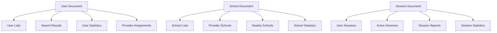

# Firebase Data Caching Guide

This guide covers the comprehensive caching system implemented for Firebase data operations in the Schools-In application.

## Overview

The Firebase caching system provides:

- **Multi-layer caching** (Memory, SessionStorage, LocalStorage, IndexedDB)
- **Intelligent cache invalidation** for data consistency
- **Real-time updates** with cache synchronization
- **Performance tracking** and cache hit rate monitoring
- **Network-aware strategies** for optimal performance
- **Automatic pre-warming** of frequently accessed data

## Architecture

```
┌─────────────────┐    ┌──────────────────┐    ┌─────────────────┐
│   Components    │───▶│   Cached Hooks   │───▶│ Cached Services │
└─────────────────┘    └──────────────────┘    └─────────────────┘
                                │                        │
                                ▼                        ▼
┌─────────────────┐    ┌──────────────────┐    ┌─────────────────┐
│  Cache Manager  │◄───│  Firebase Cache  │───▶│    Firestore    │
└─────────────────┘    └──────────────────┘    └─────────────────┘
         │
         ▼
┌─────────────────────────────────────────────────────────────────┐
│           Multi-Layer Storage                                    │
│  ┌─────────┐ ┌─────────┐ ┌─────────┐ ┌──────────────┐          │
│  │ Memory  │ │ Session │ │  Local  │ │  IndexedDB   │          │
│  │  Cache  │ │ Storage │ │ Storage │ │    Cache     │          │
│  └─────────┘ └─────────┘ └─────────┘ └──────────────┘          │
└─────────────────────────────────────────────────────────────────┘
```

## Cache Layers

### 1. Memory Cache (Fastest)
- **Usage**: Frequently accessed data
- **TTL**: 5-30 minutes
- **Capacity**: 200 entries max
- **Persistence**: Until page refresh

### 2. Session Storage (Fast)
- **Usage**: User session data
- **TTL**: Until browser tab closes
- **Capacity**: ~5-10MB
- **Persistence**: Browser session

### 3. Local Storage (Medium)
- **Usage**: User preferences, long-term data
- **TTL**: 1-24 hours
- **Capacity**: ~5-10MB
- **Persistence**: Until manually cleared

### 4. IndexedDB (Slowest, Largest)
- **Usage**: Large datasets, offline support
- **TTL**: Days to weeks
- **Capacity**: ~50MB+
- **Persistence**: Until manually cleared

## Core Components

### 1. CacheManager (`src/lib/cache/CacheManager.ts`)

Central cache orchestrator supporting multiple storage layers:

```typescript
import { cacheManager, CacheType } from '@/lib/cache/CacheManager';

// Single layer caching
await cacheManager.set('key', data, {
  type: CacheType.MEMORY,
  ttl: 30 * 60 * 1000, // 30 minutes
});

// Multi-layer caching (fallback chain)
const data = await cacheManager.getMultiLayer('key', [
  { type: CacheType.MEMORY, ttl: 30 * 60 * 1000 },
  { type: CacheType.SESSION, ttl: 60 * 60 * 1000 },
  { type: CacheType.LOCAL, ttl: 24 * 60 * 60 * 1000 },
]);
```

### 2. FirebaseCache (`src/lib/cache/FirebaseCache.ts`)

Firebase-specific caching strategies and configurations:

```typescript
import { FirebaseCache } from '@/lib/cache/FirebaseCache';

// Cache user data
const user = await FirebaseCache.cacheUserData(
  userId,
  () => fetchUserFromFirestore(userId)
);

// Cache location data  
const schools = await FirebaseCache.cacheLocationData(
  'user_schools',
  () => fetchSchoolsFromFirestore()
);

// Cache with custom options
const sessions = await FirebaseCache.cacheQuery(
  'user_sessions',
  () => fetchUserSessions(),
  [
    { type: CacheType.MEMORY, ttl: 5 * 60 * 1000 },
    { type: CacheType.SESSION, ttl: 30 * 60 * 1000 },
  ],
  {
    forceRefresh: false,
    onCacheHit: () => analytics.track('cache_hit'),
    onCacheMiss: () => analytics.track('cache_miss'),
  }
);
```

## Cached Services

### 1. Cached Authentication (`src/lib/hooks/useCachedAuth.ts`)

Enhanced authentication hook with user data caching:

```typescript
import { useCachedAuth } from '@/lib/hooks/useCachedAuth';

function MyComponent() {
  const { 
    user, 
    loading, 
    error, 
    refreshUser,
    isAuthenticated,
    isProvider,
    isAdmin 
  } = useCachedAuth();

  // Force refresh user data (bypass cache)
  const handleRefresh = () => refreshUser();

  return (
    <div>
      {isAuthenticated && (
        <div>Welcome, {user?.displayName}</div>
      )}
    </div>
  );
}
```

**Features:**
- Automatic cache restoration on page load
- Real-time auth state synchronization
- Role-based cache pre-warming
- User preference caching

### 2. Cached User Service (`src/lib/services/cachedUserService.ts`)

High-performance user operations:

```typescript
import { CachedUserService } from '@/lib/services/cachedUserService';

// Get all users with filtering and caching
const users = await CachedUserService.getAllUsers({
  role: 'provider',
  status: 'active',
}, {
  limit: 50,
  forceRefresh: false,
});

// Search users with caching
const searchResults = await CachedUserService.searchUsers('john', {
  role: 'provider',
});

// Get user statistics
const stats = await CachedUserService.getUserStats();

// Clear user cache when needed
await CachedUserService.clearUserCache();
```

### 3. Cached School Service (`src/lib/services/cachedSchoolService.ts`)

Optimized school/location operations:

```typescript
import { CachedSchoolService } from '@/lib/services/cachedSchoolService';

// Get schools by provider
const schools = await CachedSchoolService.getSchoolsByProvider(providerId);

// Search schools with caching
const searchResults = await CachedSchoolService.searchSchools('main street');

// Get nearby schools with distance calculation
const nearbySchools = await CachedSchoolService.getNearbySchools(
  latitude, 
  longitude, 
  10 // 10km radius
);

// Get school statistics
const stats = await CachedSchoolService.getSchoolStats();
```

### 4. Cached Session Hook (`src/lib/hooks/useCachedSession.ts`)

Session management with real-time updates:

```typescript
import { useCachedSession } from '@/lib/hooks/useCachedSession';

function SessionComponent() {
  const {
    activeSession,
    recentSessions,
    loading,
    createSession,
    updateSession,
    refreshSessions,
    getSessionDuration,
  } = useCachedSession(userId);

  // Check-in handler
  const handleCheckIn = async () => {
    await createSession({
      locationId: schoolId,
      status: 'active',
      startTime: new Date(),
    });
  };

  // Check-out handler
  const handleCheckOut = async () => {
    if (activeSession) {
      await updateSession(activeSession.id, {
        status: 'completed',
        endTime: new Date(),
      });
    }
  };

  return (
    <div>
      {activeSession && (
        <div>
          Active session: {getSessionDuration()}ms
        </div>
      )}
    </div>
  );
}
```

## Cache Configuration

### TTL (Time To Live) Settings

```typescript
export const CACHE_TTL = {
  SHORT: 5 * 60 * 1000,      // 5 minutes
  MEDIUM: 30 * 60 * 1000,    // 30 minutes  
  LONG: 2 * 60 * 60 * 1000,  // 2 hours
  VERY_LONG: 24 * 60 * 60 * 1000, // 1 day
  SESSION: 0,                // Until page refresh
};
```

### Data Type Configurations

```typescript
// User data - medium term, multi-layer
USER: {
  memory: { type: CacheType.MEMORY, ttl: CACHE_TTL.MEDIUM },
  session: { type: CacheType.SESSION, ttl: CACHE_TTL.LONG },
}

// Location data - long term, persistent
LOCATIONS: {
  memory: { type: CacheType.MEMORY, ttl: CACHE_TTL.LONG },
  local: { type: CacheType.LOCAL, ttl: CACHE_TTL.VERY_LONG },
  indexeddb: { type: CacheType.INDEXED_DB, ttl: CACHE_TTL.VERY_LONG },
}

// Session data - short term
SESSIONS: {
  memory: { type: CacheType.MEMORY, ttl: CACHE_TTL.SHORT },
  session: { type: CacheType.SESSION, ttl: CACHE_TTL.MEDIUM },
}
```

## Cache Strategies

### 1. Cache-First Strategy
Best for: Static data (schools, user profiles)

```typescript
// 1. Check cache
const cached = await cache.get(key);
if (cached) return cached;

// 2. Fetch from Firebase
const data = await firebaseQuery();

// 3. Store in cache
await cache.set(key, data);

return data;
```

### 2. Network-First Strategy
Best for: Dynamic data (active sessions, real-time updates)

```typescript
try {
  // 1. Try network first
  const fresh = await firebaseQuery();
  await cache.set(key, fresh);
  return fresh;
} catch (error) {
  // 2. Fallback to cache
  const cached = await cache.get(key);
  if (cached) return cached;
  throw error;
}
```

### 3. Stale-While-Revalidate
Best for: User experience optimization

```typescript
// 1. Return stale data immediately
const stale = await cache.get(key);

// 2. Fetch fresh data in background
firebaseQuery().then(fresh => {
  cache.set(key, fresh);
  // Notify components of update
});

return stale;
```

## Performance Optimization

### Cache Hit Rate Monitoring

```typescript
import { CacheTracker } from '@/lib/cache/FirebaseCache';

// Get performance statistics
const stats = CacheTracker.getStats();
console.log(`Cache hit rate: ${(stats.hitRate * 100).toFixed(1)}%`);

// In development, access global cache stats
window.__getCacheStats(); // Logs cache performance table
```

### Pre-warming Strategies

```typescript
import { CacheInitializer } from '@/lib/cache/cacheInitializer';

// Pre-warm cache for specific user
await CacheInitializer.preWarmForUser(userId, 'provider');

// Pre-warm common data
await Promise.all([
  CachedUserService.preWarmUserCache(),
  CachedSchoolService.preWarmSchoolCache(),
]);
```

### Network-Aware Caching

```typescript
// Setup network-aware cache strategies
CacheInitializer.setupNetworkAwareCache();

// Cache behavior adapts based on:
// - Online/offline status
// - Connection speed (if available)
// - Data saver preferences
```

## Cache Invalidation

### Automatic Invalidation

Write operations automatically invalidate related cache entries:

```typescript
// Creating a user invalidates user lists
await CachedUserService.createUser(userData);
// Automatically invalidates: user lists, stats, search results

// Updating a school invalidates school data
await CachedSchoolService.updateSchool(schoolId, updates);
// Automatically invalidates: school data, provider assignments, stats
```

### Manual Invalidation

```typescript
import { FirebaseCache } from '@/lib/cache/FirebaseCache';

// Clear specific cache types
await FirebaseCache.clearByType('users');
await FirebaseCache.clearByType('locations');
await FirebaseCache.clearByType('sessions');

// Clear all cache
await FirebaseCache.clearAll();

// Clear cache by pattern
await FirebaseCache.invalidateCache(['user_', 'session_']);
```

## Real-time Data Synchronization

### Cached Real-time Subscriptions

```typescript
import { subscribeToCachedDocument } from '@/lib/firebase/cachedFirestore';

// Subscribe with immediate cache response + real-time updates
const unsubscribe = subscribeToCachedDocument<Session>(
  'sessions',
  sessionId,
  (session) => {
    // Called immediately with cached data (if available)
    // Then called again with real-time updates
    setSession(session);
  }
);
```

### Cache Synchronization

Real-time listeners automatically update cache:

```typescript
// Real-time listener updates both state and cache
onSnapshot(docRef, (doc) => {
  const data = doc.data();
  
  // Update component state
  setState(data);
  
  // Update cache for future reads
  FirebaseCache.cacheUserData(cacheKey, () => Promise.resolve(data));
});
```

## Usage Examples

### Provider Dashboard with Caching

```typescript
import { useCachedAuth } from '@/lib/hooks/useCachedAuth';
import { CachedSchoolService } from '@/lib/services/cachedSchoolService';
import { useCachedSession } from '@/lib/hooks/useCachedSession';

function ProviderDashboard() {
  const { user, isProvider } = useCachedAuth();
  const { activeSession, recentSessions } = useCachedSession(user?.uid);
  const [schools, setSchools] = useState<Location[]>([]);

  useEffect(() => {
    if (isProvider && user?.uid) {
      // Load cached school data
      CachedSchoolService.getSchoolsByProvider(user.uid)
        .then(setSchools);
    }
  }, [isProvider, user?.uid]);

  // Data loads fast from cache, updates automatically via real-time subscriptions
}
```

### Admin Reports with Cached Statistics

```typescript
import { CachedUserService } from '@/lib/services/cachedUserService';
import { CachedSchoolService } from '@/lib/services/cachedSchoolService';

function AdminDashboard() {
  const [stats, setStats] = useState<any>({});
  const [loading, setLoading] = useState(true);

  useEffect(() => {
    // Load cached statistics
    Promise.all([
      CachedUserService.getUserStats(),
      CachedSchoolService.getSchoolStats(),
    ]).then(([userStats, schoolStats]) => {
      setStats({ userStats, schoolStats });
      setLoading(false);
    });
  }, []);

  // Statistics load instantly from cache, refresh periodically
}
```

### Search with Intelligent Caching

```typescript
import { CachedUserService } from '@/lib/services/cachedUserService';

function UserSearch() {
  const [query, setQuery] = useState('');
  const [results, setResults] = useState<User[]>([]);

  useEffect(() => {
    if (query.length > 2) {
      // Search results are cached for 5 minutes
      CachedUserService.searchUsers(query, { role: 'provider' })
        .then(setResults);
    }
  }, [query]);

  // Fast search results from cache, no duplicate API calls
}
```

## Initialization

### Automatic Initialization

```typescript
// Cache automatically initializes when imported
import { CacheInitializer } from '@/lib/cache/cacheInitializer';

// Cache is ready to use immediately
```

### Manual Initialization with Options

```typescript
import { CacheInitializer } from '@/lib/cache/cacheInitializer';

await CacheInitializer.initialize({
  enableMemoryCache: true,
  enableSessionCache: true,
  enableLocalCache: true,
  enableIndexedDBCache: true,
  maxMemorySize: 300,
  debug: true,
});

// Pre-warm cache for user
await CacheInitializer.preWarmForUser(userId, 'provider');
```

## Migration Guide

### From Direct Firestore to Cached Operations

```typescript
// ❌ Before: Direct Firestore calls
import { getDocument, getCollection } from '@/lib/firebase/firestore';

const user = await getDocument('users', userId);
const schools = await getCollection('locations');

// ✅ After: Cached operations
import { getCachedDocument, getCachedCollection } from '@/lib/firebase/cachedFirestore';

const user = await getCachedDocument('users', userId);
const schools = await getCachedCollection('locations');
```

### From Regular Hooks to Cached Hooks

```typescript
// ❌ Before: Regular auth hook
import { useAuth } from '@/lib/hooks/useAuth';

// ✅ After: Cached auth hook  
import { useCachedAuth } from '@/lib/hooks/useCachedAuth';

// Same API, better performance
const { user, loading } = useCachedAuth();
```

## Performance Monitoring

### Cache Performance Metrics

```typescript
import { CacheTracker } from '@/lib/cache/FirebaseCache';
import { CacheInitializer } from '@/lib/cache/cacheInitializer';

// Get detailed performance statistics
const stats = CacheInitializer.getCacheStats();

console.log('Cache Performance:', {
  hitRate: `${(stats.tracker.hitRate * 100).toFixed(1)}%`,
  totalQueries: stats.tracker.queries,
  cacheHits: stats.tracker.hits,
  cacheMisses: stats.tracker.misses,
});

// Reset tracking statistics
CacheTracker.reset();
```

### Debug Mode

```typescript
// Enable debug logging in development
if (process.env.NODE_ENV === 'development') {
  // Access cache stats from browser console
  window.__getCacheStats(); // Shows performance table
}
```

## Cache Invalidation Patterns

### Data Mutation Patterns

```typescript
// ✅ Good: Automatic cache invalidation
await CachedUserService.updateUser(userId, { name: 'New Name' });
// Automatically invalidates:
// - User document cache
// - User list caches  
// - Search result caches
// - User statistics cache

// ✅ Good: Batch operations with bulk invalidation
await CachedUserService.batchUpdateUsers([
  { userId: 'user1', updates: { status: 'active' } },
  { userId: 'user2', updates: { status: 'inactive' } },
]);
// Invalidates all related caches efficiently
```

### Cache Dependencies



## Best Practices

### 1. Cache Selection

```typescript
// ✅ Good: Choose appropriate cache layer
// Frequently accessed, small data → Memory cache
// User session data → Session storage
// User preferences → Local storage  
// Large datasets, offline support → IndexedDB

// ✅ Good: Use multi-layer for important data
const configs = [
  { type: CacheType.MEMORY, ttl: CACHE_TTL.SHORT },     // Fast access
  { type: CacheType.SESSION, ttl: CACHE_TTL.MEDIUM },   // Session persistence
  { type: CacheType.LOCAL, ttl: CACHE_TTL.LONG },       // Long-term storage
];
```

### 2. Cache Key Design

```typescript
// ✅ Good: Descriptive, hierarchical keys
const cacheKey = FirebaseCache.generateQueryKey(
  'schools',
  { providerId, region, status },
  'name_asc',
  limit
);
// Results in: "schools_f:providerId:123|region:north|status:active_o:name_asc_l:20"

// ❌ Bad: Generic, collision-prone keys
const cacheKey = 'data'; // Too generic
const cacheKey = userId; // Missing context
```

### 3. Error Handling

```typescript
// ✅ Good: Graceful cache failures
try {
  const cached = await cache.get(key);
  if (cached) return cached;
  
  const fresh = await firebaseQuery();
  await cache.set(key, fresh).catch(() => {
    // Log cache write failure but don't throw
    console.warn('Cache write failed');
  });
  
  return fresh;
} catch (error) {
  // Always have fallback for cache failures
  return defaultData;
}
```

### 4. Cache Warming

```typescript
// ✅ Good: Strategic pre-warming
// Pre-warm on app start
CacheInitializer.preWarmForUser(userId, userRole);

// Pre-warm on route navigation
router.events.on('routeChangeStart', (url) => {
  if (url.includes('/dashboard')) {
    CachedSchoolService.preWarmSchoolCache(userId);
  }
});

// Pre-warm on user interaction
button.addEventListener('mouseenter', () => {
  // Pre-load next page data
  CachedUserService.getAllUsers();
});
```

## Troubleshooting

### Common Issues

1. **Cache not updating:**
   - Check cache invalidation patterns
   - Verify real-time subscriptions are updating cache
   - Use `forceRefresh: true` for testing

2. **Poor cache hit rate:**
   - Review cache key generation
   - Check TTL configurations
   - Monitor cache size limits

3. **Memory issues:**
   - Reduce memory cache size
   - Implement more aggressive cleanup
   - Move large data to IndexedDB

### Debug Commands

```typescript
// Check cache performance
window.__getCacheStats();

// Export all cache data
const cacheData = await CacheInitializer.exportCacheData();

// Clear specific cache type
await FirebaseCache.clearByType('users');

// Reset entire cache system
await CacheInitializer.reset();
```

### Performance Monitoring

```typescript
// Track cache performance in production
analytics.track('cache_performance', {
  hitRate: stats.hitRate,
  totalQueries: stats.queries,
  averageResponseTime: averageTime,
});

// Monitor cache size and cleanup frequency
analytics.track('cache_health', {
  memorySize: cacheSize,
  cleanupFrequency: cleanupCount,
  indexedDBSize: idbSize,
});
```

## Future Enhancements

1. **Advanced Query Caching**: Cache complex Firestore composite queries
2. **Predictive Pre-loading**: ML-based cache warming
3. **Cache Compression**: Reduce memory footprint for large datasets
4. **Distributed Cache**: Redis/Memcached integration for server-side caching
5. **Cache Analytics**: Advanced metrics and optimization insights

## References

- [Firebase Firestore Caching](https://firebase.google.com/docs/firestore/manage-data/enable-offline)
- [Service Worker Caching Strategies](https://developers.google.com/web/fundamentals/instant-and-offline/offline-cookbook)
- [IndexedDB Best Practices](https://web.dev/indexeddb-best-practices/)
- [React Query Patterns](https://react-query.tanstack.com/guides/caching)
